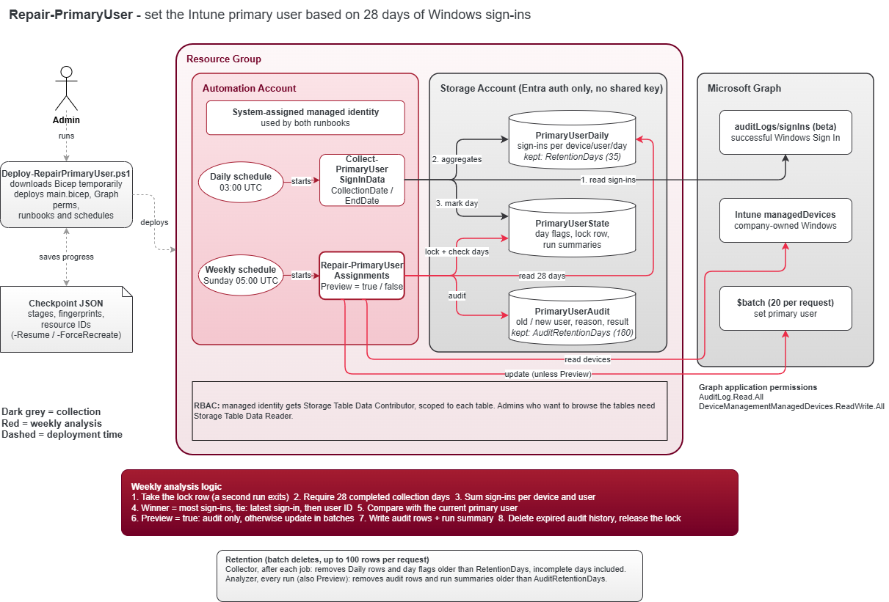

# Repair Primary User

This Azure Automation solution repairs Microsoft Intune primary-user assignments from successful Windows sign-ins. It uses two independently scheduled PowerShell 7 runbooks and compact Azure Table aggregates. The scripts require PowerShell 7.2 or later; any newer 7.x version works as well.

## Architecture



The daily collector reads the previous completed UTC day, counts successful `Windows Sign In` events by device and user, and stores only the count and latest sign-in timestamp. Raw audit events are not stored.

The weekly analyzer requires every expected daily partition to be marked `Complete`. It totals the previous 28 days, selects the user with the most sign-ins, and uses the latest successful sign-in as a deterministic tie-breaker. Devices excluded by Microsoft Entra group or device name prefix, such as shared devices, never get a primary user, and an existing primary user is removed. Other devices without eligible sign-ins are unchanged.

## Azure resources

The deployment creates:

- One StorageV2 account with shared-key access disabled.
- `PrimaryUserDaily`, `PrimaryUserState`, and `PrimaryUserAudit` Azure Tables.
- One Azure Automation Account with a system-assigned managed identity.
- Two Automation String variables for [device exclusions](#excluding-devices), empty by default.
- `Storage Table Data Contributor` assignments scoped to the three solution tables.
- Published daily and weekly runbooks with UTC schedules. They are imported with the PowerShell 7.2 runtime; you can switch them to a newer PowerShell 7.x runtime in the Automation Account.

The managed identity requires these Microsoft Graph application permissions:

- `AuditLog.Read.All`: reads the sign-in logs.
- `DeviceManagementManagedDevices.ReadWrite.All`: reads Intune devices and sets or removes primary users.
- `GroupMember.Read.All`: reads device exclusion groups and their members.
- `Device.Read.All`: reads the device IDs of exclusion group members.

The deployment script can grant all four permissions. It grants the last two even when no exclusion group is configured, so groups can be added later without redeploying. The administrator running it needs permission to deploy Azure resources and role assignments, plus a Microsoft Entra role permitted to grant application permissions. Microsoft Entra audit-log licensing and retention must cover the configured analysis period.

If the deploying account cannot create role assignments, for example with only `Contributor`, the script deploys everything else without the table role assignments. It then prints a `New-AzRoleAssignment` block and an Azure portal alternative for an `Owner`, `User Access Administrator`, or `Role Based Access Control Administrator`. Assigning `Storage Table Data Contributor` on the storage account or on each solution table is accepted. Until the assignments exist, the runbooks cannot use their tables and the checkpoint stays incomplete. After they are created, rerun the deployment with `-Resume` to verify them and complete the checkpoint. Role assignments created outside the template are also detected when an `Owner` later redeploys.

## Deployment

Run the deployment from PowerShell 7.2 or later on an administration workstation or Azure Cloud Shell. The script uses `bicep` from PATH if available. On Windows, if it is missing, the script asks to download a temporary Bicep executable from the official Azure Bicep release. Use `-InstallTemporaryBicep` to approve this download without a prompt.

Keep `main.bicep` from the same version beside `Deploy-RepairPrimaryUser.ps1`; the script stops if the template is older. For each runbook, the deployment checks `..\Runbooks` first, then the deployment script's own folder. If neither location contains the required file, deployment stops and reports both checked paths. A `-Resume` run is the exception for runbooks that an earlier run already imported: it verifies they are still published and skips content checks, so only the deployment script, `main.bicep`, and the checkpoint are needed.

The downloaded executable must have a valid Microsoft Authenticode signature before it is run. It is added to PATH only for this deployment; the original PATH is restored and the temporary directory is removed on success or failure. No administrator rights are normally required. On other platforms, install Bicep on PATH before deploying.

```powershell
pwsh.exe -NoProfile -File .\Deployment\Deploy-RepairPrimaryUser.ps1 `
    -SubscriptionId '<subscription-id>' `
    -TenantId '<tenant-id>' `
    -ResourceGroupName 'rg-repair-primary-user' `
    -Location 'westeurope' `
    -StorageAccountName '<globally-unique-storage-name>' `
    -InstallMissingModules `
    -InstallTemporaryBicep
```

Defaults:

- Daily collection: `03:00` UTC.
- Weekly analysis: Sunday at `05:00` UTC.
- Analysis window: 28 completed UTC days.
- Daily aggregate retention: 35 days.
- Assignment mode: apply changes.
- Device exclusions: none.

The weekly time must be at least one hour after the daily collection time. Override the defaults with `-CollectorStartTimeUtc`, `-AnalyzerStartTimeUtc`, and `-AnalyzerDayOfWeek`.

Use `-SkipGraphPermissionGrant` only when all four Graph application permissions will be assigned to the Automation Account managed identity separately.

## Initial warm-up

The analyzer intentionally fails without making changes until all 28 required daily partitions exist. This protects assignments from incomplete evidence. After first deployment, either allow 28 daily collections to complete or backfill an inclusive date range with `CollectionDate` and `CollectionEndDate`.

The [date-range example under Daily collection](#daily-collection) collects September 24 through October 21, 2026: 28 completed UTC days. Replace those dates with the 28 days ending yesterday to prepare for the scheduled analyzer. Backfilling requires those dates to remain available in your tenant's sign-in logs; split larger collections into smaller ranges if needed. Disable the weekly schedule during backfill, then run a preview before enabling scheduled changes.

For controlled testing, start the analyzer manually with a smaller `DaysToAnalyze` value after collecting those dates explicitly. Restore the scheduled value to 28 before production use.

## Table schema

`PrimaryUserDaily` stores one row per UTC date, device, and user:

- `PartitionKey`: collection date as `yyyyMMdd`.
- `RowKey`: `<device-guid>|<user-guid>`.
- `DeviceId`: Microsoft Entra device ID.
- `UserId`: Microsoft Entra user ID.
- `UserPrincipalName`: user principal name from that user's latest sign-in on the device that day. Rows collected before this column was added have no value; recollect those dates with `ForceRecollect` to fill it.
- `SignInCount`: successful sign-ins for that day.
- `LatestSignIn`: latest successful sign-in in UTC.

`PrimaryUserState` stores collection status, analysis locks, and run summaries. Collection rows use partition `Collection` and row key `yyyyMMdd`. Their `Status` is `Collecting`, `Complete`, or `LowSignInCount`; `EventCount` holds the day's successful sign-ins and `MinimumSignInCount` the minimum that applied. Weekly summaries use `AnalysisRuns`; they include the number of excluded devices in `Excluded` and the exclusions in effect in `ExcludedGroupIds` and `ExcludedDeviceNamePrefixes`.

`PrimaryUserAudit` stores one row per evaluated Intune device and weekly run. Its partition key is the unique run ID. Outcomes include `Unchanged`, `Preview`, `Updated`, and `Failed`. Besides device and user IDs, each row stores `PreviousUserPrincipalName`, `RecommendedUserPrincipalName`, `PreviousUserSignInCount`, `SignInCount` (recommended user), `DeviceSignInCount`, `DistinctUserCount`, and `LatestSignIn`. Rows for devices that change also store `ChangeReason`: `NoPrimaryUser`, `NoSignInsByPrimaryUser`, `MoreSignIns`, `LatestSignIn`, `UserIdOrder`, or `Excluded` for a removed primary user. Rows for excluded devices have no recommended user and store the matching rule in `ExcludedBy`, for example `Prefix KIOSK-`.

## Running a single job in the Azure portal

You can run either published runbook once with custom parameters without changing its schedule:

1. Open the deployed **Automation Account** in the Azure portal, select **Runbooks**, then select `Collect-PrimaryUserSignInData` or `Repair-PrimaryUserAssignments`.
2. Select **Start** and enter `StorageAccountName`. Leave other inputs at their defaults unless you want to override them for this job.
3. For collection, enter `CollectionDate` for a single completed UTC day, or also enter `CollectionEndDate` for an inclusive range. Use `yyyy-MM-dd`; set `ForceRecollect` to `true` only to rebuild already-completed days.
4. For analysis, set `Preview` to `true` to write recommendations without changing Intune, and optionally set `PreviewDeviceCount` to the number of example devices to list. For a historical window, also set `AnalysisEndDate` to its last completed UTC day and, if needed, `DaysToAnalyze`.
5. Confirm **Start**, then inspect the job's **Output** and **Errors**. Wait for collection to finish successfully before starting analysis.

Boolean inputs use `true` or `false` in the portal, not PowerShell's `$true` or `$false`. Parameters apply only to that job; the weekly schedule still applies assignments by default.

## Daily collection

The scheduled collector processes the previous completed UTC date. To recollect a specific date after a failed or incorrect run:

```powershell
Start-AzAutomationRunbook `
    -ResourceGroupName 'rg-repair-primary-user' `
    -AutomationAccountName '<automation-account>' `
    -Name 'Collect-PrimaryUserSignInData' `
    -Parameters @{
        StorageAccountName = '<storage-account>'
        CollectionDate = '2026-09-01'
        ForceRecollect = $true
    }
```

Collection uses replacement semantics. An incomplete date partition is deleted and rebuilt, so restarting it does not double-count sign-ins. Completed dates are skipped unless `ForceRecollect` is supplied.

`ForceRecollect` is a Boolean runbook input, defaulting to `false`. In the portal select `true` to rebuild completed dates. When invoking the script directly, use `-ForceRecollect $true`.

For smaller environments, backfill an inclusive range in a single job by supplying `CollectionDate` and `CollectionEndDate`, both in `yyyy-MM-dd` format:

```powershell
Start-AzAutomationRunbook `
    -ResourceGroupName 'rg-repair-primary-user' `
    -AutomationAccountName '<automation-account>' `
    -Name 'Collect-PrimaryUserSignInData' `
    -Parameters @{
        StorageAccountName = '<storage-account>'
        CollectionDate = '2026-09-24'
        CollectionEndDate = '2026-10-21'
    }
```

This collects all 28 days from September 24 through October 21, oldest first, processing and retaining aggregates for only one day in memory at a time. `CollectionEndDate` requires `CollectionDate`; the end must be on or after the start, and all dates must be completed UTC days. Omitting both dates still collects only yesterday.

Each day has its own completion state. If one day fails, the job stops; rerun the same range to skip completed dates and retry the failed and remaining dates. `ForceRecollect` rebuilds every date in the range, including completed dates. Keep ranges within your tenant's available sign-in log history and the Automation job runtime limit; use smaller ranges or separate jobs for larger environments. Do not overlap range jobs with another collector job for the same dates.

### Days with too few sign-ins

A day whose successful sign-ins are below `MinimumSignInCount` (default 1) is saved with status `LowSignInCount` instead of `Complete`. This catches days where the sign-in log query returned no data. The job writes a warning for the day, continues with the remaining dates, and then fails with a list of the affected dates and their counts. The analyzer stops until those dates are `Complete`, and its error shows each date's status.

- To collect a low day again, rerun the collector for that date or the same range. `LowSignInCount` dates are collected again without `ForceRecollect`, while complete dates are skipped.
- To accept a low count that is expected, for example a holiday, collect that date with `MinimumSignInCount` set to `0`. The date then stays complete for later runs.
- For stricter detection, set `MinimumSignInCount` to a value below your normal daily volume, for example `100`. The deployed daily schedule uses the default; add the parameter to the schedule link to change it.

Complete dates collected before `MinimumSignInCount` existed are collected again when their `EventCount` is below the minimum, so an earlier empty day is repaired by rerunning its range.

## Data retention

Both runbooks delete expired rows in Table Storage entity group transactions of up to 100 rows per request. Queries request only `PartitionKey` and `RowKey` and are processed page by page, so deleting a day with tens of thousands of device/user rows takes a few hundred requests instead of one request per row.

- **Collector (`RetentionDays`, default 35):** after every date in the job is collected, including jobs that end with `LowSignInCount` dates, every `PrimaryUserDaily` row and `Collection` state row dated more than `RetentionDays` before the last collected date is deleted. This includes days left incomplete by failed collections. Keep retention greater than the analysis window; 35 days provides seven days of recovery margin.
- **Analyzer (`AuditRetentionDays`, default 180):** at the end of each weekly run, including preview runs and failed analyses, `PrimaryUserAudit` partitions and `AnalysisRuns` summaries older than `AuditRetentionDays` are deleted while the analysis lock is still held. A failed cleanup is reported as a warning and does not change the run result.

The deployed weekly schedule does not pass `AuditRetentionDays`, so the default applies. To keep a different period, add the parameter to the `RepairPrimaryUser-WeeklyAnalysis` schedule link or start the runbook manually with it.

## Weekly analysis

Assignments are applied by default. Run a preview manually before enabling production changes or after changing policy:

```powershell
Start-AzAutomationRunbook `
    -ResourceGroupName 'rg-repair-primary-user' `
    -AutomationAccountName '<automation-account>' `
    -Name 'Repair-PrimaryUserAssignments' `
    -Parameters @{
        StorageAccountName = '<storage-account>'
        Preview = $true
        PreviewDeviceCount = 100
    }
```

Preview recommendations are written to `PrimaryUserAudit` and no Intune assignment request is submitted. The scheduled run omits `Preview` and therefore applies changes.

`Preview` is a Boolean runbook input, defaulting to `false`. Select `true` in the portal to preview, or use `-Preview $true` when invoking the script directly.

`PreviewDeviceCount` (0 to 1000, default 50) sets how many devices that would change are listed in the preview job output. The first devices found are listed as a table sorted by device name:

| Column | Content |
| --- | --- |
| `DeviceName` | Intune device name. |
| `IntuneDeviceId` | Intune managed device ID. |
| `CurrentPrimaryUser` | Current primary user's UPN, the user ID when no UPN is known, or `(none)`. |
| `CurrentUserSignIns` | Current primary user's sign-ins on the device in the analysis window. |
| `NewPrimaryUser` | Recommended user's UPN, the user ID when no UPN is known, or `(none)` when an excluded device's primary user is removed. |
| `NewUserSignIns` | Recommended user's sign-ins on the device in the analysis window. |
| `NewUserShare` | Recommended user's share of all sign-ins on the device. |
| `DeviceUsers` | Distinct users who signed in on the device. |
| `NewUserLastSignInUtc` | Recommended user's latest sign-in on the device. |
| `LastIntuneSyncUtc` | Device's last Intune sync. |
| `Reason` | No primary user, current user has no sign-ins, more sign-ins, a tie resolved by latest sign-in or user ID order, or `Excluded device` with the matching rule. |

For excluded devices, the new user's sign-in columns are empty. Set `PreviewDeviceCount` to 0 to print only the totals. Every recommendation, including those beyond the listed count, is in the run's `PrimaryUserAudit` partition. Each run, including scheduled runs, also prints the number of changes per reason.

UPNs come from the collected sign-ins and from Intune's primary user data, so no additional Graph permission is needed. A recommended user who has no collected UPN and is not the primary user of any Intune device is shown by user ID.

The analyzer:

1. Acquires an Azure Table lock to prevent overlapping weekly runs.
2. Verifies all expected collection states.
3. Reads the device exclusions and the device members of excluded groups.
4. Aggregates daily device/user counts.
5. Pages company-owned Windows Intune devices.
6. Skips unchanged devices.
7. Sends changed assignments and primary-user removals in Microsoft Graph batches of at most 20.
8. Retries throttled and transient requests and records each outcome.
9. Deletes audit history older than `AuditRetentionDays`, then releases the lock.

## Excluding devices

Devices that must never have a primary user, such as shared, kiosk, or lab devices, can be excluded by Microsoft Entra group, by device name prefix, or both. The analyzer never assigns a primary user to an excluded device. If an excluded device already has one, for example from enrollment or a manual assignment, the analyzer removes it, even when the device has no collected sign-ins.

The exclusions are stored in two String variables in the Automation Account. The deployment creates both empty, which means no exclusions.

| Variable | Content |
| --- | --- |
| `RepairPrimaryUser-ExcludedGroupIds` | Object IDs of Microsoft Entra groups. Their device members, including devices in nested groups, are excluded. |
| `RepairPrimaryUser-ExcludedDeviceNamePrefixes` | Device name prefixes, such as `KIOSK-`. Matching ignores case; a single trailing `*` is optional. |

Separate entries with commas, semicolons, spaces, or line breaks, without quotation marks. Prefixes are checked before groups; the first matching rule is recorded for the device.

Set the variables with the deployment script. An omitted parameter keeps its variable's current value, including edits made in the portal, and `''` removes all entries:

```powershell
pwsh.exe -NoProfile -File .\Deployment\Deploy-RepairPrimaryUser.ps1 -Resume `
    -ExcludedGroupIds '<group-object-id>' `
    -ExcludedDeviceNamePrefixes 'KIOSK-,LAB-'
```

With `pwsh.exe -File`, pass several entries as one comma-separated value as shown; PowerShell array syntax does not reach the script intact. When you run the script in the current PowerShell session, arrays such as `'KIOSK-', 'LAB-'` and `@()` also work. Invalid entries stop the script before any change. Alternatively, edit the variables in the Automation Account under **Shared Resources** > **Variables**. Changes apply from the next analyzer run.

- Add the devices themselves to an exclusion group, not their users. A group without device members produces a warning in the job output.
- Group membership is read from an eventually consistent Microsoft Graph index, so a device added shortly before a run might not be excluded until the next run.
- Exclusion groups require the `GroupMember.Read.All` and `Device.Read.All` permissions. Managed identity tokens are cached, so newly granted permissions can take several hours to take effect.
- The analyzer fails closed when an exclusion variable is missing or contains an invalid entry, when an excluded group is not found or cannot be read, or when a group member has no device ID. That run changes no primary users.
- Exclusions apply to the devices that the analyzer evaluates: company-owned Windows devices.

Run a preview after changing exclusions. Planned removals are listed with the reason `Excluded device` and the matching rule. Removals are audited with `ChangeReason` `Excluded` and the rule in `ExcludedBy`.

To add device exclusions to an existing deployment, rerun the deployment script with `-Resume`, or with the original parameters if the checkpoint file is not available. The run grants the two additional permissions and creates both variables before it imports the updated analyzer, which stops when they are missing. Granting the permissions requires the same Microsoft Entra role as the first deployment; with `-SkipGraphPermissionGrant`, assign them separately.

## Monitoring and recovery

- Check Azure Automation job output and errors for both runbooks.
- Inspect the `Collection` partition in `PrimaryUserState` for missing or non-`Complete` dates, including `LowSignInCount` dates.
- Recollect a missing date with `CollectionDate` and `ForceRecollect`, then rerun the analyzer. `LowSignInCount` dates are collected again without `ForceRecollect`.
- Inspect `AnalysisRuns` in `PrimaryUserState` for weekly totals and terminal status.
- Inspect the matching run-ID partition in `PrimaryUserAudit` for device-level recommendations and failures.
- A stale analysis lock is replaced after 12 hours by default. Lower `StaleLockHours` only when a complete analysis is known to finish sooner.

The analyzer fails closed: missing daily data, invalid or unreadable device exclusions, Graph retrieval failures, or lock conflicts stop the run before new assignments or removals are submitted. Individual batch failures are audited and do not hide successful updates from the same run.

## Cost and scale

Storage contains compact aggregates rather than raw audit events. Approximate daily row count is the number of distinct device/user combinations that signed in that day, not the number of sign-in events. Azure Automation and Microsoft Graph limits still vary by tenant size; review job memory, duration, throttling, and table growth before broad production rollout.

## Removal

Unregister and remove the two schedules, remove the two Automation runbooks and the two exclusion variables, revoke the managed identity's four Graph app-role assignments, and delete the resource group if it contains only this solution. Deleting the resource group permanently removes aggregate and audit history.

## Change history

See [changelog.md](changelog.md).
